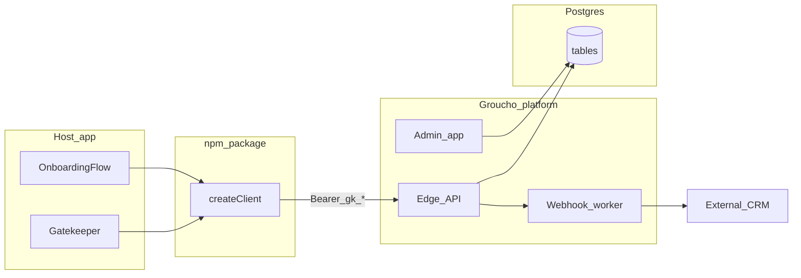

# Groucho — Product Requirements Document (v1)

**Version:** 1.1-draft  
**Status:** Living document — aligned to repo prompts and phased roadmap  
**References:** [prompts/01-scoring-system.md](../prompts/01-scoring-system.md), [02](../prompts/02-chat-integration.md), [03](../prompts/03-admin-dashboard.md), [04](../prompts/04-email-flow.md), [05](../prompts/05-conversation-logic.md)

---

## 1. Executive summary

**Groucho** is a configurable **conversational runtime** for two complementary **project modes** (see §2.2), delivered as a hosted **platform** + **npm package**:

1. **Gatekeeper** — Short, values-oriented qualification (typically 3–4 exchanges) ending in **pass / redirect / reject**, with **per-message scoring**, durable **sessions**, optional **post-pass email**, and **webhooks**.
2. **Onboarding flow** — **Multistep** guided dialogue (e.g. community member intake): collect **intent**, **interests**, and **values** over several phases, then emit a **structured profile** (JSON) for the host to preload a user record, drive **initial role assignment**, and feed **recommendations**—without losing transcript auditability.

Both modes share the same **session / message / verdict** spine, **project-scoped API keys**, and integration hooks; behaviour is selected per **project** (type + flow configuration).

**Product split**

1. **Platform** — Multi-tenant SaaS: organisations, projects, API keys, **flow definitions** (gatekeeper vs onboarding + versioned config), agent/persona configuration, engagement analytics, webhooks, invitations, and (later) billing and BYO LLM provider keys.
2. **Package (`@groucho/sdk`, name TBD)** — npm distribution: **HTTP client**, **UI primitives**, and embeddable session UIs (**`<Gatekeeper />`** for qualification; **`OnboardingFlow`** or unified **`<GrouchoSession />`** with `variant` — exact export TBD in [sdk-surface.md](./sdk-surface.md)) talking to the same **project-scoped API**.

**v1 thesis:** Host applications embed Groucho against a **stable, versioned HTTP API**; all sessions, messages, verdicts, and **derived profiles** are **isolated by organisation and project**; API keys are **hashed at rest** and never logged in plaintext.

---

## 2. Vision and problem statement

### 2.1 Problem

Teams need to **qualify** visitors (culture, community, premium access, B2B trials) **and** **onboard** them into a community or product surface **without** long static forms or opaque black boxes. They need:

- **Explainable outcomes** and **audit trails** (who said what, when, and why the session completed).
- **Structured answers** suitable for **profile preload** (e.g. “favourite show” → community profile field), **initial role assignment**, and **recommendation** inputs—without forcing Groucho to own every downstream rule on day one.

### 2.2 Solution

An opinionated **conversation + (optional) scoring + verdict + structured extraction** pipeline:

- **Gatekeeper path:** conversation + scoring + terminal outcome (existing prompts [05](../prompts/05-conversation-logic.md), [01](../prompts/01-scoring-system.md)).
- **Onboarding path:** **flow spec** (ordered steps, prompts, extraction schema) + transcript in `messages` + **validated `profile` JSON** on completion (and in webhook payloads) for host systems to consume.

Hosted control plane + drop-in client for builders; host remains responsible for **mapping** `profile` keys to its own user model unless explicitly extended later.

---

## 3. Goals and non-goals

### 3.1 Goals (v1)

| ID | Goal |
|----|------|
| G1 | **Gatekeeper conversation engine** — Terse assistant persona; **~3–4 exchanges**; deterministic pass/redirect/reject strings mapped to stored outcomes (**project mode = gatekeeper**; see §6.1). |
| G2 | **Scoring** — Three dimensions (specificity, authenticity, cultural depth) + overall; weighted; stored per user turn where scoring applies; graceful degradation on scorer failure (**primarily gatekeeper**; onboarding may omit or use lighter scoring per project policy). |
| G3 | **Persistence** — Sessions and messages with metadata; terminal state; optional success secret for post-pass flows; **onboarding sessions** store **structured `profile`** on completion (see §6.7–6.8). |
| G4 | **Operator UX** — Real-time or near-real-time visibility into sessions, messages, scores, **and extracted profile (read-only)** for onboarding projects, filters. |
| G5 | **Post-pass email** — Verify eligible session before persisting email; no enumeration; rate limits. |
| G6 | **Platform** — Orgs, members, invitations, projects (**type + flow config**), API keys (`gk_test_` / `gk_live_`), webhooks configuration; multi-step project creation with intentional friction. |
| G7 | **Public API + SDK** — Documented session lifecycle; TypeScript client + **Gatekeeper + onboarding session UI** + primitives (see [sdk-surface.md](./sdk-surface.md)). |
| G8 | **Onboarding flows** — Projects can define **multistep** flows (ordered steps, goals, optional fixed questions); step transitions, abandon/timeout, resume by `sessionId` documented. |
| G9 | **Structured profile output** — On completion, API and webhooks expose **`profile` JSON** (+ `flow_version`) validated against a **project JSON Schema**; host maps fields to its community profile / CRM. |
| G10 | **Downstream hooks** — Webhook (and/or `GET session`) payloads sufficient for host to implement **initial roles** and **recommendations** using `profile` + transcript (**host-side rules in v1 default**; see §3.3). |

### 3.2 Non-goals (v1)

| ID | Non-goal | Notes |
|----|----------|--------|
| NG1 | Full **billing** | Stub events / “coming soon” in UI only. |
| NG2 | **BYO LLM** execution in browser | v1.5: encrypted provider keys, **server-side** routing only. |
| NG3 | Full white-label **theme marketplace** | One polished **dark** theme + design tokens in SDK. |
| NG4 | Non-React frameworks in v1 | React first; document REST for others. |
| NG5 | **In-product community recommender** or **Discord/Slack role sync** as Groucho-owned features | v1 delivers **data + webhooks**; host applies business rules unless explicitly scoped later. |

### 3.3 v1 scope guardrail — roles and recommendations

- **Default (v1):** Groucho produces **`profile`**, **`outcome`**, and **`verdicts`** (+ webhooks). The **host application** maps `profile` to community fields, computes **initial roles**, and runs **recommendations** (or calls its own ML).
- **Optional stretch:** Project-configured **deterministic rules** (e.g. tag sets → `suggested_role_ids[]`) executed **server-side in Groucho** — only if explicitly added to roadmap; document separately to avoid scope creep.

---

## 4. Personas

| Persona | Description | Primary jobs |
|---------|-------------|--------------|
| **Org owner** | Pays for / owns the organisation | Org settings, billing (future), invite admins, all projects. |
| **Admin** | Day-to-day configuration | Projects, keys, webhooks, personas, view all sessions. |
| **Member** | Limited access | View sessions / analytics per policy (configurable). |
| **Builder** | Integrates Groucho into a host app | Install SDK, configure keys (via env / server), ship Gatekeeper, onboarding UI, or headless client. |
| **Operator** | Support / moderation | Live feed, filters, export, investigate scores and **onboarding profiles**. |
| **Applicant (end user)** | Passes through a gate or onboarding project | Short qualification **or** multistep onboarding; clear outcome; optional email where product requires it. |
| **New member (community)** | Completes onboarding flow | Answers intent / interests / values; sees how data will be used per host copy (host-implemented consent UI surrounding embed). |

---

## 5. User journeys (summary)

### 5.1 Org bootstrap

1. Owner signs up → creates **organisation** (name, slug).  
2. Invites teammates via **invitations** (email, role, expiry token).  
3. Accept invite → `organisation_members` row (accepted_at).

### 5.2 Project creation (friction intentional)

Multi-step wizard (see [platform-project-wizard.md](./platform-project-wizard.md)): not a one-click create — reinforces that the gate affects real users and integrations.

### 5.3 Host integration

1. Builder creates **project** → receives **API key** once (plaintext shown single time; stored as hash).  
2. Host app either: **(A)** proxies requests with secret on server (recommended), or **(B)** uses a publishable / live key in browser with strict CORS and rate limits (see [adr/0001-api-key-and-client-access.md](./adr/0001-api-key-and-client-access.md)).  
3. SDK `createClient` + `<Gatekeeper projectRef={...} />` or raw REST.

### 5.4 Applicant (gatekeeper)

1. Opens embedded or linked experience → **session** starts (live or dry-run).  
2. Exchanges messages → scores persisted on user messages (when scoring enabled).  
3. Terminal assistant message → **verdict** + session outcome; webhook fired if configured; pass → optional **email** on access page.

### 5.5 Applicant (onboarding flow)

1. Same session bootstrap as §5.4; **project** resolves **onboarding** mode and **flow version**.  
2. User progresses through **steps** (defined in project `flow_config`): intent → interests / values → optional freeform; assistant behaviour and max turns **per step** come from config (not necessarily 2-line Lou style).  
3. On **completion** (terminal step satisfied or explicit “done”): server runs **structured extraction** (validated JSON), persists **`profile`** (and optional `verdicts` row), updates session status; **webhook** includes `profile`, `flow_version`, `project_type`.  
4. Host consumes payload to **preload community profile**, assign **initial roles**, and/or feed **recommenders** (host-side in v1 default per §3.3).

---

## 6. Functional requirements

### 6.1 Conversation and outcomes (FR-CONV)

**Scope:** Requirements **FR-CONV-1–4** apply to **project mode = gatekeeper**. Onboarding projects use **FR-FLOW** / **FR-PROFILE** for step structure and completion; they may reuse a subset of FR-CONV patterns only where explicitly configured.

| Req | Description | Acceptance criteria |
|-----|-------------|---------------------|
| FR-CONV-1 | Assistant follows brevity and structure in [05-conversation-logic.md](../prompts/05-conversation-logic.md). | Prompt versioned per project/persona; max 2 lines per turn enforced in tests or post-check (**gatekeeper**). |
| FR-CONV-2 | Pass phrase exactly `Yeah. Here.` (or project-configured equivalent stored server-side). | Integration test: exact string → pass path when scores meet threshold. |
| FR-CONV-3 | Redirect phrase `REDIRECT`; reject phrase `REJECTED` (align DB enum `REJECT` vs string in migration note). | Mapping table in code + OpenAPI enum documented. |
| FR-CONV-4 | ~3–4 exchanges before decision unless model ends early per policy. | `turns_used` / message count enforced or soft-guided in prompt + optional server cap (**gatekeeper**). |

**Current implementation note:** [app/api/chat/route.ts](../app/api/chat/route.ts) uses persona thresholds to refine pass/reject vs redirect; v1 PRD keeps this as **configurable policy** per **gatekeeper** project.

### 6.2 Scoring (FR-SCORE)

| Req | Description | Acceptance criteria |
|-----|-------------|---------------------|
| FR-SCORE-1 | Dimensions 0–1: specificity, authenticity, cultural_depth; overall weighted. | Documented weights in project config or code constants + PRD appendix. |
| FR-SCORE-2 | Scorer uses model API with structured JSON output. | JSON schema validated; invalid → neutral scores. |
| FR-SCORE-3 | Scores attached to **user** message record. | `messages.metadata.scores` populated before assistant reply persisted (current behaviour). |

### 6.3 Chat pipeline (FR-CHAT)

| Req | Description | Acceptance criteria |
|-----|-------------|---------------------|
| FR-CHAT-1 | Order: persist user → score → model → persist assistant → update session/outcome → optional verdict row. | Idempotent where possible; documented in OpenAPI. |
| FR-CHAT-2 | New session / conversation on first user message. | No empty conversation rows (matches current “create on first message” pattern). |
| FR-CHAT-3 | Concluded session rejects further posts with 409. | Same as current `Session concluded` response from `/api/chat`. |
| FR-CHAT-4 | Rapid sends: serialise or debounce per `session_id`. | Load test: no double terminal states. |
| FR-CHAT-5 | LLM timeout → 503, no partial terminal state without compensating transaction. | Documented error model. |

### 6.4 Admin dashboard (FR-ADMIN)

| Req | Description | Acceptance criteria |
|-----|-------------|---------------------|
| FR-ADMIN-1 | List sessions reverse-chronological with status badges. | Matches [03](../prompts/03-admin-dashboard.md). |
| FR-ADMIN-2 | Expandable thread; scores visible (bars or numbers). | Realtime or ≤5s polling fallback. |
| FR-ADMIN-3 | Filter by status. | Query param or client filter documented. |
| FR-ADMIN-4 | (Stretch) Stats header + CSV export. | Separate milestone. |
| FR-ADMIN-5 | For **onboarding** projects, show **extracted `profile`** (read-only JSON + pretty view) alongside transcript. | Operator can verify extraction without raw SQL. |

### 6.5 Email access (FR-EMAIL)

| Req | Description | Acceptance criteria |
|-----|-------------|---------------------|
| FR-EMAIL-1 | Only **passed** session may submit email. | Server verifies session + secret or server-issued token. |
| FR-EMAIL-2 | Upsert profile; link `profile_eligibility` to session/conversation. | No error text revealing duplicate email. |
| FR-EMAIL-3 | Rate limit submissions. | Per-IP + per-session limits. |

### 6.6 Platform (FR-PLAT)

| Req | Description | Acceptance criteria |
|-----|-------------|---------------------|
| FR-PLAT-1 | CRUD for organisations, projects (scoped), members, invitations. | RLS tests pass (see [schema-migration.md](./schema-migration.md)). |
| FR-PLAT-2 | API keys: prefix, hash, label, revoke, `last_used_at`. | Plaintext shown once at creation. |
| FR-PLAT-3 | Webhooks: URL, secret, events JSON, active flag. | Signed delivery; retry with backoff; status on verdicts. |
| FR-PLAT-4 | Multi-step project wizard. | Cannot skip required steps; confirm screen before persist. |
| FR-PLAT-5 | **Project mode** (`gatekeeper` \| `onboarding`) and **`flow_config`** (versioned JSON or separate `project_flows` rows). | Wizard + API reject invalid configs; schema version bump on breaking changes. |
| FR-PLAT-6 | Webhook payloads for `session.completed` / `verdict.created` include **`project_type`**, **`flow_version`**, and when applicable **`profile`** (see §6.8). | Documented payload JSON Schema; hosts can branch on `project_type`. |

### 6.7 Onboarding flows (FR-FLOW)

| Req | Description | Acceptance criteria |
|-----|-------------|---------------------|
| FR-FLOW-1 | Project defines ordered **steps** (id, title, system/developer prompt fragments, max user turns, optional fixed questions). | Invalid DAG rejected at save time; max steps TBD (e.g. ≤12). |
| FR-FLOW-2 | Session tracks **`current_step_id`** (or equivalent) server-side; client may send hint but server is source of truth. | `GET /v1/sessions/{id}` returns current step + allowed actions. |
| FR-FLOW-3 | **Abandon** and **timeout** transitions to terminal status (`abandoned`) without partial `profile` unless product policy allows partial save (document choice). | No infinite active sessions. |
| FR-FLOW-4 | Same **message POST** contract as gatekeeper **or** documented step-completion endpoint—pick one in OpenAPI and keep v1 consistent. | Contract tests cover onboarding happy path. |

### 6.8 Structured profile extraction (FR-PROFILE)

| Req | Description | Acceptance criteria |
|-----|-------------|---------------------|
| FR-PROFILE-1 | On onboarding **completion**, server produces **`profile` object** conforming to project **JSON Schema** (stored on `sessions` and/or **`verdicts`** per [schema-migration.md](./schema-migration.md)). | Invalid extraction → retry UX or soft failure path documented; never silent corrupt JSON. |
| FR-PROFILE-2 | **Field mapping** from answers to profile keys is defined in **`flow_config`** (e.g. `favourite_show` ← step “Favourite show?”), not hardcoded application logic. | Changing copy in wizard does not break host mapping if keys stable. |
| FR-PROFILE-3 | **PII & consent** — sensitive fields flagged in schema; platform docs require host surround UX for consent where legally needed. | NFR-SEC-2 extended; retention note in privacy appendix. |
| FR-PROFILE-4 | Optional **append-only** `session_profile_snapshots` (or `verdicts` only) if re-extraction is needed; v1 can use single final `profile` on verdict. | Document immutability guarantees for auditors. |

---

## 7. Non-functional requirements (NFR)

| ID | Category | Requirement |
|----|----------|-------------|
| NFR-SEC-1 | Security | Tenant isolation via RLS; API keys hashed (e.g. bcrypt/argon2); webhook HMAC signatures. |
| NFR-SEC-2 | Privacy | No cross-tenant reads; minimal PII in logs; retention policy documented; **`profile`** treated as PII where applicable; no logging full `profile` in application logs. |
| NFR-PERF-1 | Performance | p95 chat round-trip target TBD (e.g. &lt;5s excluding host network); scorer parallelised where safe. |
| NFR-REL-1 | Reliability | Webhook at-least-once delivery with dedupe key on `verdicts.id`. |
| NFR-A11Y-1 | Accessibility | Gatekeeper: focus order, live regions for new messages, contrast for dark theme. |

---

## 8. Technical architecture

### 8.1 High-level

### 8.2 Data model (target v1)

Canonical tables (detail in [schema-migration.md](./schema-migration.md)):

- `organisations`, `organisation_members`, `invitations`
- `projects` (includes **`project_type`**, **`flow_config`** jsonb and/or **`project_flows`** version table), `api_keys`
- `sessions` (optional **`profile` jsonb**, **`current_step_id`**, **`flow_version`**), `messages`, `verdicts`, `webhooks`
- Optional: **`session_profile_snapshots`** for audit / re-extraction (defer if `verdicts.profile` sufficient)
- Extensions: `profiles`, `profile_eligibility`, `personas` / `project_agents` (see migration doc)

### 8.3 API surface

Normative HTTP contract: [api/openapi.yaml](./api/openapi.yaml).

**Endpoint summary (v1 target)**

| Method | Path | Auth | Purpose |
|--------|------|------|---------|
| `POST` | `/v1/sessions/{sessionId}/messages` | Bearer `gk_*` | User turn → assistant reply + scores + status (**both modes** unless step-specific route added) |
| `GET` | `/v1/sessions/{sessionId}` | Bearer `gk_*` | **Required for onboarding UX:** returns `status`, `outcome`, **`current_step`**, **`flow_version`**, partial or final **`profile`** when completed |
| `POST` | `/v1/sessions/{sessionId}/access` | Bearer `gk_*` or public + secret | Post-pass email capture |
| `POST` | `/internal/orgs/{orgId}/projects` | Platform user session | Create project (wizard); see wizard doc |

Platform **internal** routes are out of scope for the public OpenAPI file; document in a separate `internal-openapi.yaml` when implemented.

---

## 9. Security and tenancy (summary)

- **Authentication:** Platform users via standard auth (e.g. Supabase Auth). Host **project** access via `api_keys` presented as `Authorization: Bearer gk_...`.
- **Authorisation:** RLS from `organisation_id` / `project_id` on all tenant rows.
- **Key handling:** Decision recorded in ADR [0001](./adr/0001-api-key-and-client-access.md).

---

## 10. Risks and open decisions

| Topic | Risk / decision | Mitigation |
|-------|-----------------|------------|
| Key in browser | Secret leakage, abuse | Prefer server proxy + short-lived session token (ADR-0001). |
| Streaming | Complexity vs DB consistency | v1 may remain non-streaming HTTP; document SSE in v1.1 if needed. |
| Outcome strings vs enums | `REJECTED` text vs `REJECT` enum | Single mapping layer in API. |
| Dry-run | `sessions.mode` semantics | Define: no webhooks, no email, optional watermark in transcript. |
| **Flow vs host schema drift** | Host community profile fields change independently of Groucho `flow_config` | Version `flow_config`; document host migration; webhook includes `flow_version`. |
| **Extraction quality** | LLM returns invalid or hallucinated structure | Enforce JSON Schema validation; bounded retries; fallback messages to user. |
| **Longer sessions** | Onboarding = more tokens and abuse surface | Stricter rate limits per project type; optional max session duration. |
| **Dual product modes** | Single codebase conflates gatekeeper and onboarding | Feature flag + project_type routing in API; separate integration tests per mode. |

---

## 11. Acceptance criteria (release level)

**v1.0 platform + API**

- [ ] Org with 2+ members; invite flow works end-to-end.  
- [ ] Project wizard completes with friction (minimum time or steps enforced).  
- [ ] API key created, shown once, verified on chat request; revoked key returns 401.  
- [ ] Session lifecycle matches OpenAPI; 409 on concluded session.  
- [ ] RLS: member of org A cannot read org B’s sessions (automated test).  
- [ ] **Onboarding:** at least one reference `flow_config` completes with valid **`profile`** in `GET session` and webhook payload.  
- [ ] **Onboarding:** admin UI shows transcript + **profile** (FR-ADMIN-5).  

**v1.0 SDK**

- [ ] `createClient` + types published; example Next.js app runs against staging.  
- [ ] `<Gatekeeper />` completes a dry-run session in Storybook or example.  
- [ ] **Onboarding** component (or `GrouchoSession` variant) completes a dry-run **onboarding** project end-to-end in example app.  

**v1.0 webhooks (if in scope for same release)**

- [ ] Signed payload delivered; retries update `verdicts.webhook_status`.  
- [ ] Payload includes **`project_type`**, **`flow_version`**, and **`profile`** when onboarding project completes (FR-PLAT-6).

---

## 12. Document map

| Document | Purpose |
|----------|---------|
| [adr/0001-api-key-and-client-access.md](./adr/0001-api-key-and-client-access.md) | API key exposure model |
| [database-setup.md](./database-setup.md) | Local / hosted DB bootstrap for engineers |
| [schema-migration.md](./schema-migration.md) | Current DB → target + RLS matrix |
| [platform-project-wizard.md](./platform-project-wizard.md) | Multi-step project UX spec |
| [api/openapi.yaml](./api/openapi.yaml) | Public HTTP API |
| [sdk-surface.md](./sdk-surface.md) | npm package exports |
| [roadmap-github-issues.md](./roadmap-github-issues.md) | Phased issues for tracking |

Implementation follow-ups (not duplicate PRD): extend [api/openapi.yaml](./api/openapi.yaml) session schema, [sdk-surface.md](./sdk-surface.md) for onboarding component exports, and [schema-migration.md](./schema-migration.md) for `flow_config` / `profile` columns.

---

## 13. Revision history

| Date | Author | Change |
|------|--------|--------|
| 2026-04-08 | Engineering | Initial PRD from Groucho v1 plan |
| 2026-04-08 | Engineering | v1.1: onboarding flows, structured `profile`, FR-FLOW/FR-PROFILE, goals G8–G10, NG5, API/session notes, risks |
